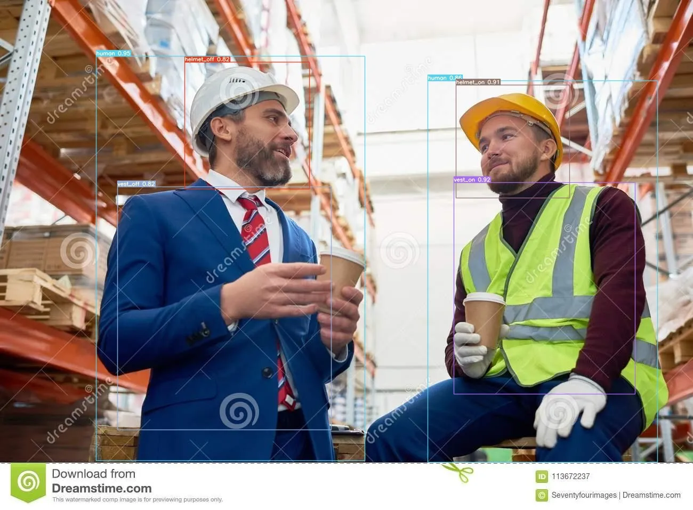

# Introduction

jackv7 is a model specifically designed for PPE(Personal Protective Equipment), primarily capable of detecting whether workers are wearing safety equipment, such as safety helmets and safety vests etc.

Here is our hugging face space: [https://huggingface.co/spaces/aiotads/jackv7](https://huggingface.co/spaces/aiotads/jack_v7)

Below are the results of using public datasets and actually running in space.

 

 

 

 

# Reference
 - yolov7: https://github.com/WongKinYiu/yolov7
 - Roboflow: https://universe.roboflow.com/search?q=ppe

# Contributor

Author | E-mail | Corp.|
|:---:|:---:|:---:|
|Hueiru|hueiru_chen@inndisk.com|innodisk Inc|
|Jack|juihung_weng@innodisk.com|innodisk Inc|